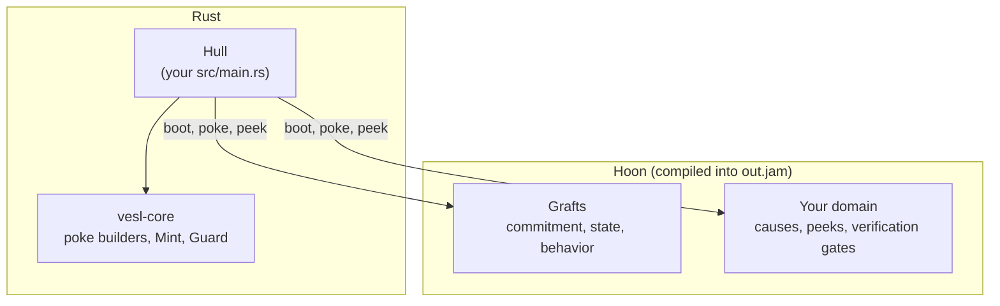

# NockApp Anatomy

A nockapp is a compiled Hoon kernel (`out.jam`) booted inside a Rust hull. vesl supplies most of the kernel as a graft library and gives you a CLI that splices those grafts into the source you compile.

## A basic walk through Hoon

Two kinds of message flow between the hull and the kernel:

- **Poke** — a write. The hull sends a tagged command (called a *cause*); the kernel may update state and emits a list of *effects* (events) back. The closest Rust analog is a method on `&mut self`.
- **Peek** — a read. The hull queries kernel state at a path; the kernel returns the value (or `~` for none) without modifying anything. The closest Rust analog is a method on `&self`.

A poke is how you *do* something to the kernel; a peek is how you *ask* it something.

Inside the kernel, one Hoon-specific term:

- **Gate** — a Hoon function. A *verification gate* takes a payload and returns true or false — the kernel uses gates to decide whether to accept something (e.g. "does this proof verify against this Merkle root?").

The rest of this page (and most of the rest of the guide) uses these words constantly.

## Anatomy



Your hull (`src/main.rs`) is the Rust binary that hosts the kernel. It imports `vesl-core` for `Mint`, `Guard`, and a poke builder per graft operation, boots the compiled kernel via `nockapp::kernel::boot::setup`, and shuttles pokes and peeks across the Rust-to-Hoon boundary. Inside the kernel sit the grafts — Hoon libraries installed into `hoon/lib/` and composed in at the `::  nockup:*` marker comments — and your domain: the cause tags, peek paths, and verification gates you write between those markers. The domain is where your app logic lives — if the grafts are the contract, the domain is the app.

(Some docs and source comments call this layer the *driver* — same thing. "Driver" is also reserved upstream in nockchain for I/O subcomponents inside `NockApp` (`nockapp::driver`); those run inside the hull and aren't surfaced through the SDK.)

## The hull

The hull is the Rust process that hosts the kernel. It boots the compiled JAM as an embedded `NockApp`, routes inbound requests into pokes and peeks, and surfaces effects back to the caller. The kernel is pure logic; the hull does the I/O — HTTP, the chain client, the filesystem, persistent checkpoints.

In a vesl nockapp, the hull is whatever your `src/main.rs` builds with `nockapp::kernel::boot::setup`. The [Hull](/build/hull) page covers the canonical shape; for a thin reference harness, [vesl-core](https://github.com/zkvesl/vesl-core) ships a `hull/` template with kernel boot and `/commit` / `/verify` endpoints — fork it when you want a generic process around a vesl kernel.

## Grafts

Grafts are pre-written Hoon libraries that ship as `<name>-graft.hoon` plus a sibling `<name>-graft.toml` manifest. Each manifest declares blocks of Hoon code keyed to specific marker comments — imports, state fields, cause-union variants, poke arms, peek arms, effect variants. `graft-inject` discovers manifests under `hoon/lib/`, splices their blocks into your `app.hoon` at the markers, and writes the result.

Thirteen grafts ship today across four families plus a placeholder:

- **Commitment** — `settle-graft`, `mint-graft`, `guard-graft`, `forge-graft`. Merkle trees, root registration, payload verification, STARK proving.
- **State** — `kv-graft`, `counter-graft`, `queue-graft`, `rbac-graft`, `registry-graft`. Domain-keyed state primitives.
- **Behavior** — `validate-graft`, `log-graft`, `clock-graft`, `batch-graft`. Pre-flight checks, audit trail, deterministic clock, settlement-flush buffer.
- **Intent (placeholder)** — `intent-graft`. Reserved for multi-party coordination; crashes on invocation until upstream lands.

[Grafts](/build/grafts) covers the family taxonomy with priority bands.

## Your domain

Concretely, your domain is the application-specific Hoon you write into the marker slots — usually dozens of lines, not hundreds. Imagine a simple licensing app: a publisher commits to a Merkle root over a set of license IDs, and buyers later prove they hold one. The grafts do the cryptography (Merkle math, root registration, proof verification); your domain is what's left. Each piece lands at a specific marker in `app.hoon`:

```hoon
::  nockup:cause — declare a new poke variant
[%issue-license id=@ buyer=@]

::  nockup:domain-effect — declare what the kernel emits in response
[%license-issued id=@ buyer=@]

::  nockup:poke — handle the cause, mutate state, emit the effect
%issue-license
  :_  state(licenses (~(put by licenses.state) buyer.u.act id.u.act))
  ~[[%license-issued id.u.act buyer.u.act]]

::  nockup:peek — return licenses for a buyer
[%licenses-of buyer=@ ~]  ``(~(get by licenses.state) buyer)
```

You can also swap the default hash-comparison verification gate for a signature check or STARK gate by setting `[graft.gates]` in a graft manifest — that lives in a `.toml` rather than at a marker.

Anything that involves network I/O, disk persistence, environment variables, or external APIs stays in the hull. The kernel is pure logic; your domain is the small slice of that logic that's specific to your app.

More on this in [Kernel](/build/kernel), which walks each domain pattern in detail.

## How they compose

```
my-app/
├── Cargo.toml          # path deps + [patch] blocks
├── build.rs            # no-op (hoonc runs in Step 4)
├── src/main.rs         # your hull
├── hoon/
│   ├── app/app.hoon    # marker template + grafts + your domain
│   ├── lib/            # graft libraries (.hoon + .toml manifests)
│   └── common/         # shared libs (zeke.hoon, ztd/, ...)
└── out.jam             # compiled kernel (after hoonc)
```

`graft-inject inject --apply hoon/app/app.hoon` splices graft blocks into the source file at the markers; `hoonc` compiles the result to `out.jam`; the hull loads it via `boot::setup`. The CLI is preview-by-default (the supply-chain guardrail described in [Inject](/build/inject)); nothing lands on disk until you pass `--apply`.

## What's deterministic and why

Nock is [nockchain](https://github.com/nockchain/nockchain)'s combinator calculus, JAM is its serialization format, and the deterministic interpreter that gives a kernel exactly one possible output for any given input is part of the nockchain runtime. STARK proving (used by `forge-graft`) is also nockchain's stack — `vesl-prover.hoon` and the constraint tables under `hoon/dat/` ride on the upstream prover. vesl runs a Hoon kernel inside the nockchain `NockApp` and ships a graft library and a CLI on top: it does not invent determinism, proving, or the noun model.

The vesl-core entry types (`Mint`, `Guard`, the four primitives) are documented at [`crates/vesl-core/src/lib.rs#L1-L40`](https://github.com/zkvesl/vesl-core/blob/11d110d/crates/vesl-core/src/lib.rs#L1-L40); start there if you want to read source.
