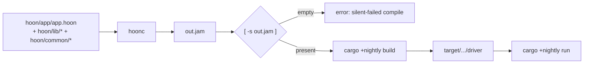

# Build & Run

Two compile steps: `hoonc` produces `out.jam` from your composed Hoon, then `cargo +nightly build` produces the driver binary that loads it. `cargo +nightly run` does both (assuming `out.jam` is already current).



## Compile the kernel

```bash
hoonc hoon/app/app.hoon hoon/ && [ -s out.jam ] || \
  (echo "hoonc: silent-failed — exit 0 but no out.jam" >&2; exit 1)
```

The `[ -s out.jam ]` guard is load-bearing. Structural type errors during eager-parse can leave hoonc with no panic message, exit 0, and no `out.jam` written — without the guard you walk into the next step against a stale kernel from the previous compile. The bug class (hoonc's exit-0-with-no-jam silent-fail) is one of the highest-friction failure modes; the guard catches it deterministically.

If you're iterating and want to bypass hoonc's cache, add `--new`.

## verify-jam — structured alternative

For the silent-fail case AND the case where `out.jam` exists but is stale (kernel sources edited without recompile), pair the hoonc invocation with `vesl-test verify-jam`:

```bash
hoonc --new hoon/app/app.hoon hoon/ && [ -s out.jam ] || exit 1
sha256sum hoon/app/app.hoon hoon/lib/*.toml > .out-jam-source-fingerprint
vesl-test verify-jam .   # exit 0 fresh, 1 stale, 2 no fingerprint
```

The fingerprint sidecar pins the source bytes the current `out.jam` was compiled from. Most useful right before driving a kernel that took 10+ minutes to compile.

## Build the driver

```bash
cargo +nightly build
```

First build compiles the full nockchain stack — expect 2–5 minutes with path deps (faster on subsequent builds), or longer if any nockchain git deps resolve over the network.

## Run

```bash
cargo +nightly run
```

Expected output for the canonical [quickstart driver](/setup/quickstart#6-exercise-the-lifecycle):

```
  effect: %settle-registered
  effect: %settle-noted
```

Each line is one effect from the kernel, parsed via `vesl_core::effect_head_tags(&effects)` in the driver.

## Settlement modes

A nockapp can run kernel-only (no chain interaction) or with full settlement against a nockchain endpoint. Settlement mode is set via `--settlement-mode`, `VESL_SETTLEMENT_MODE`, or `settlement_mode` in `vesl.toml`:

| Mode | What happens | Chain required |
|------|-------------|----------------|
| `local` | Kernel verifies, no chain interaction. Default. | No |
| `fakenet` | Sign, build tx, submit to a local nockchain fakenet. | Yes (local) |
| `dumbnet` | Same as fakenet but uses a real seed phrase for key derivation. | Yes (live) |

Passing `--chain-endpoint` or `--submit` without an explicit mode infers `fakenet`. The full precedence chain is: CLI flag > env var > `vesl.toml` > mode defaults.

For `dumbnet`, the hull needs a signing key. Resolution order: `--seed-phrase-file <path>` (recommended; keeps the value out of `ps` output), `--seed-phrase <phrase>` (visible in process table), `VESL_SEED_PHRASE`. See [Reference / vesl.toml](/reference/vesl-toml) for the full field list.

## JAM determinism

JAM is [nockchain](https://github.com/nockchain/nockchain)'s serialization format; the deterministic interpreter that compiles a Hoon kernel to a single canonical byte sequence is part of the nockchain runtime, not vesl. vesl-core fingerprints the commitment kernels in `assets/CHECKSUMS.sha256` and recomputes the sha256 at build time via `build.rs` — a stale `.jam` won't silently boot a stale kernel.

After modifying any kernel source — or any library it transitively imports — recompile each kernel, refresh `assets/CHECKSUMS.sha256`, and ship the artifact change in a dedicated commit so the reviewer sees the JAM diff in isolation.

If a determinism check fails on kernel sources you haven't touched, two real failure modes — same regen fix:

1. Local `hoonc` is stale relative to the nockchain pin. Reinstall: `cd $NOCK_HOME && make install-hoonc`.
2. The committed JAMs predate the current pin (they were never re-synced). Regenerate against the pin and commit.

## See also

- [vesl-nockup README — Step 4 (compile)](https://github.com/zkvesl/vesl-nockup/blob/main/README.md#step-4--compile-the-kernel)
- [vesl-nockup README — Step 5 (build/run)](https://github.com/zkvesl/vesl-nockup/blob/main/README.md#step-5--build-and-run)
- [Reference / vesl.toml](/reference/vesl-toml)
