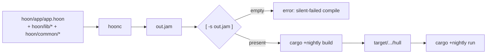

# Build & Run

Two compile steps: `hoonc` produces `out.jam` from your composed Hoon, then `cargo +nightly build` produces the hull binary that loads it. `cargo +nightly run` does both (assuming `out.jam` is already current).



## Compile the Kernel

```bash
hoonc hoon/app/app.hoon hoon/ && [ -s out.jam ] || \
  (echo "hoonc: silent-failed — exit 0 but no out.jam" >&2; exit 1)
```

The `[ -s out.jam ]` guard is load-bearing. Structural type errors during eager-parse can leave hoonc with no panic message, exit 0, and no `out.jam` written — without the guard you walk into the next step against a stale kernel from the previous compile. The bug class (hoonc's exit-0-with-no-jam silent-fail) is one of the highest-friction failure modes; the guard catches it deterministically.

If you're iterating and want to bypass hoonc's cache, add `--new`.

## verify-jam — Structured Alternative

For the silent-fail case AND the case where `out.jam` exists but is stale (kernel sources edited without recompile), pair the hoonc invocation with `vesl-test verify-jam`:

```bash
hoonc --new hoon/app/app.hoon hoon/ && [ -s out.jam ] || exit 1
sha256sum hoon/app/app.hoon hoon/lib/*.toml > .out-jam-source-fingerprint
vesl-test verify-jam .   # exit 0 fresh, 1 stale, 2 no fingerprint
```

The fingerprint sidecar pins the source bytes the current `out.jam` was compiled from. Most useful right before driving a kernel that took 10+ minutes to compile.

## Build the Hull

```bash
cargo +nightly build
```

First build compiles the full nockchain stack — expect 2–5 minutes with path deps (faster on subsequent builds), or longer if any nockchain git deps resolve over the network.

## Run

```bash
cargo +nightly run
```

Expected output for the canonical [quickstart hull](/setup/quickstart#6-exercise-the-lifecycle):

```
  effect: %settle-registered
  effect: %settle-noted
```

Each line is one effect from the kernel, parsed via `vesl_core::effect_head_tags(&effects)` in the hull.

## Settlement Modes

A nockapp can run kernel-only (no chain interaction) or with full settlement against a nockchain endpoint. Settlement mode is set via `--settlement-mode`, `VESL_SETTLEMENT_MODE`, or `settlement_mode` in `vesl.toml`:

| Mode | What happens | Chain required |
|------|-------------|----------------|
| `local` | Kernel verifies, no chain interaction. Default. | No |
| `fakenet` | Sign, build tx, submit to a local nockchain fakenet. | Yes (local) |
| `dumbnet` | Same as fakenet but uses a real seed phrase for key derivation. | Yes (live) |

Passing `--chain-endpoint` or `--submit` without an explicit mode infers `fakenet`. The full precedence chain is: CLI flag > env var > `vesl.toml` > mode defaults.

A minimal `vesl.toml` for local-mode runs:

```toml
nock_home = "../nockchain"
api_port = 3000
settlement_mode = "local"
```

`nock_home` points to your nockchain monorepo checkout. `api_port` is read by hulls that expose an HTTP shell (e.g. vesl-core's `hull/` template). The full field list lives in [Reference / vesl.toml](/reference/vesl-toml). For `fakenet` and `dumbnet`, the walkthroughs below cover endpoint and key resolution.

## Fakenet Walkthrough

Fakenet is a local nockchain testnet — sandboxed, but the full settlement pipeline runs end-to-end (sign, build tx, submit, wait for acceptance). Reach for fakenet once kernel logic is stable in `local` mode and you need to drive real transactions.

**Prerequisites.** Install the `nockchain` and `nockchain-wallet` binaries from your nockchain monorepo checkout:

```bash
cd $NOCK_HOME && make install-nockchain && make install-nockchain-wallet
```

**1. Set the mining pkh.** The fakenet miner mines coinbase UTXOs to the pkh in `.env`. Your hull must control the corresponding signing key, or it can't spend those UTXOs. For vesl-core's `hull/` template, the demo signing key's pkh is the canonical choice:

```bash
cd $NOCK_HOME
cp .env_example .env
# Replace MINING_PKH with the demo signing key's pkh
# (defined in vesl-core/hull/src/signing.rs::DEMO_KEY_PKH_BASE58)
sed -i 's/^MINING_PKH=.*/MINING_PKH=5pJiNWqnouxku6SvGU6XZhu98nHH5VFMaNJ4r1vtHxPJ5sHurHBfYnk/' .env
```

For a custom hull, mine to whatever pkh your hull's fakenet signing key controls.

**2. Boot the hub + miner.** Run each in its own working directory so checkpoint state stays isolated:

```bash
mkdir fakenet-hub fakenet-miner
cp .env fakenet-hub/ && cp .env fakenet-miner/

# Shell 1: hub (binds gRPC to 127.0.0.1:5555)
cd fakenet-hub && sh ../scripts/run_nockchain_node_fakenet.sh

# Shell 2: miner (mines to MINING_PKH from .env)
cd fakenet-miner && sh ../scripts/run_nockchain_miner_fakenet.sh
```

**3. Configure your hull.** In your project's `vesl.toml`:

```toml
nock_home = "../nockchain"
settlement_mode = "fakenet"
chain_endpoint = "http://127.0.0.1:5555"
tx_fee = 256                # network minimum, in nicks
coinbase_timelock_min = 1   # spendable after 1 confirmation
accept_timeout_secs = 300   # fakenet default
```

`chain_endpoint` must match the port the hub binds (`5555` per the upstream script). vesl-core's compiled-in default of `http://localhost:9090` is from a different layout — set the field explicitly to avoid silent mismatch.

**4. Run the hull:**

```bash
cargo +nightly run -- --settlement-mode fakenet
```

Each settled note produces `%settle-noted` followed by a `tx_id` in the effect list, and stderr shows the tx submission and acceptance. Expect a few seconds of pipeline latency per settle as the tx works through mempool and into a mined block.

## Dumbnet Walkthrough

Dumbnet runs the same pipeline as fakenet against the live network, using a real seed phrase for key derivation. Use it once your kernel is stable on fakenet — every transaction has economic stakes.

**1. Generate or reuse a key pair:**

```bash
nockchain-wallet keygen
```

Capture the seed phrase out-of-band; you'll feed it to the hull via a file flag rather than `vesl.toml`.

**2. Stash the seed phrase** in a permission-locked file:

```bash
mkdir -p ~/.config/vesl && touch ~/.config/vesl/dumbnet.seed
chmod 600 ~/.config/vesl/dumbnet.seed
$EDITOR ~/.config/vesl/dumbnet.seed
```

The file form keeps the value out of `ps` output. Resolution order is: `--seed-phrase-file <path>` > `--seed-phrase <phrase>` > `VESL_SEED_PHRASE` > `[wallet] seed_phrase = "..."` in `vesl.toml`. Avoid the last form for production — it pins live key material in a file that may end up in source control.

**3. Configure your hull:**

```toml
nock_home = "../nockchain"
settlement_mode = "dumbnet"
chain_endpoint = "https://your-nockchain-rpc.example"   # required
tx_fee = 256
coinbase_timelock_min = 1
accept_timeout_secs = 900   # dumbnet default; blocks land every ~10 min

[wallet]
account = 0
```

`chain_endpoint` is required for dumbnet — there is no compiled-in default. `accept_timeout_secs = 900` matches the live-network block cadence; a settle that triggers a tx won't return its effect until the network accepts.

**4. Run the hull**, supplying the seed phrase via the file flag:

```bash
cargo +nightly run -- \
  --settlement-mode dumbnet \
  --seed-phrase-file ~/.config/vesl/dumbnet.seed
```

For deployment, lock down both the seed file and the host running the hull — the BIP-39/BIP-44 derivation gives the hull spend authority over any UTXO locked to the resulting pkh.

## JAM Determinism

JAM is [nockchain](https://github.com/nockchain/nockchain)'s serialization format; the deterministic interpreter that compiles a Hoon kernel to a single canonical byte sequence is part of the nockchain runtime, not vesl. vesl-core fingerprints the commitment kernels in `assets/CHECKSUMS.sha256` and recomputes the sha256 at build time via `build.rs` — a stale `.jam` won't silently boot a stale kernel.

After modifying any kernel source — or any library it transitively imports — recompile each kernel, refresh `assets/CHECKSUMS.sha256`, and ship the artifact change in a dedicated commit so the reviewer sees the JAM diff in isolation.

If a determinism check fails on kernel sources you haven't touched, two real failure modes — same regen fix:

1. Local `hoonc` is stale relative to the nockchain pin. Reinstall: `cd $NOCK_HOME && make install-hoonc`.
2. The committed JAMs predate the current pin (they were never re-synced). Regenerate against the pin and commit.

## See Also

- [vesl-nockup README — Step 4 (compile)](https://github.com/zkvesl/vesl-nockup/blob/main/README.md#step-4--compile-the-kernel)
- [vesl-nockup README — Step 5 (build/run)](https://github.com/zkvesl/vesl-nockup/blob/main/README.md#step-5--build-and-run)
- [nockchain README — Run a testnet](https://github.com/nockchain/nockchain/blob/main/README.md#how-do-i-run-a-testnet) — upstream fakenet hub + miner setup.
- [`vesl-core/hull/src/signing.rs`](https://github.com/zkvesl/vesl-core/blob/11d110d/hull/src/signing.rs) — `demo_signing_key()` and `DEMO_KEY_PKH_BASE58`.
- [Reference / vesl.toml](/reference/vesl-toml) — full field list including the `[wallet]` schema.
