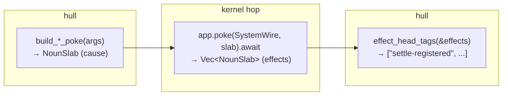

# Hull

The hull is the Rust side of your nockapp — the program in `src/main.rs` that boots `out.jam` as a `NockApp`, sends pokes, and reads effects back. Most of the noun construction is done for you by `vesl-core`'s `build_*_poke` helpers; you write the orchestration.

::: info Before We Start

Three terms used throughout:

- **Atom** — a non-negative integer. Hoon's primitive scalar type. Auras (`@t`, `@ud`, `@tas`, …) annotate how to read an atom — UTF-8 cord, decimal number, lowercase symbol — without changing the underlying value.
- **Noun** — the universal value type in Nock and Hoon. Either an atom or a *cell* (an ordered pair of two nouns). Every value a kernel handles — state, causes, effects — is a noun.
- **NounSlab** — the Rust noun container. A hull allocates nouns into a slab, builds the poke head and arguments inside it, then submits the slab to the kernel via `app.poke(...)`. Defined at `nockapp::noun::slab::NounSlab`.

All three have full entries in [Reference / Glossary](/reference/glossary).

:::



## The Shape of a Hull

A hull boots the compiled kernel via `nockapp::kernel::boot::setup`, sends pokes with `app.poke(SystemWire, slab).await`, and reads back the effect list the kernel returns. The canonical shape is the [30-line hull from the quickstart](/setup/quickstart#6-exercise-the-lifecycle); the rest of this page covers the patterns inside it.

## Poke Builders

`vesl-core` ships one `build_*_poke` helper per shipped graft cause. Each takes typed Rust primitives in and returns a ready-to-poke `NounSlab` out:

```rust
use vesl_core::{Mint, Tip5Hash, build_settle_register_poke, build_settle_note_poke};

let mut mint = Mint::new();
let root: Tip5Hash = mint.commit(&[b"first"]);

let register = build_settle_register_poke(1, &root);
let note     = build_settle_note_poke(1, 1, &root, b"first");
```

The full set covers settle, mint, guard, forge, plus state and behavior grafts (`build_kv_set_poke`, `build_counter_inc_poke`, `build_log_append_poke`, etc.). See [`crates/vesl-core/src/lib.rs`](https://github.com/zkvesl/vesl-core/blob/11d110d/crates/vesl-core/src/lib.rs#L1-L40) for the entry-point map.

For grafts that store structured data (`registry`, `log`, `queue`, `batch`), use the paired `_from_noun` helper to jam the payload internally rather than passing a raw `&[u8]`:

```rust
let mut record = NounSlab::new();
record.set_root(your_noun);
let slab = build_registry_put_poke_from_noun(key, &record);
```

The byte-taking variants (`build_registry_put_poke(key, &jammed_bytes)`) trust the caller to have already jammed the payload.

## Sending Pokes

```rust
let effects = app.poke(SystemWire.to_wire(), slab).await?;
```

`SystemWire` is the standard wire identity for system-level pokes. The poke is async; `app.poke` returns `Vec<NounSlab>` — the kernel's effect list, one effect per element.

## Parsing Effects

```rust
for tag in vesl_core::effect_head_tags(&effects) {
    println!("  effect: %{tag}");
}
```

`effect_head_tags` walks each effect noun and pulls the head atom as a string. For typed effect decoding beyond the head tag, see `vesl_core::effect_head_tag` (singular) and the per-graft `decode_*_effect` helpers in the source.

## Hull/Kernel Drift Detection

A vesl scaffold's `build.rs` runs `nockup graft codegen kernel-cause-tags` after `hoonc`. The codegen writes `kernel_cause_tags.rs` to `OUT_DIR` and exposes its path as `KERNEL_CAUSE_TAGS_PATH`. Include the file in your hull and assert each cause tag at compile time:

```rust
include!(env!("KERNEL_CAUSE_TAGS_PATH"));

fn build_settle_register_poke(hull: u64, root: &Tip5Hash) -> NounSlab {
    assert_kernel_cause_tag!("settle-register");
    // ... construct the noun ...
}
```

`assert_kernel_cause_tag!` runs at compile time. A kernel rename (e.g. `%settle-register` → `%settle-write`) regenerates the slice on the next `cargo build`; the stale `"settle-register"` literal in the hull then fails the membership check and `cargo build` halts:

```text
error[E0080]: evaluation of constant value failed
  --> src/hull.rs:12:5
   |
12 |     assert_kernel_cause_tag!("settle-register");
   |     ^^^^^^^^^^^^^^^^^^^^^^^^^^^^^^^^^^^^^^^^^^^
   |     |
   |     the evaluated program panicked at 'cause tag `settle-register` not
   |     in KERNEL_CAUSE_TAGS — re-run `nockup graft codegen kernel-cause-tags`
   |     and check the driver's poke builder against the kernel's cause $%.'
   |
   = note: this error originates in the macro `assert_kernel_cause_tag`
```

The drift is surfaced as a compile error instead of a silent `Ok(vec![])` from `app.poke(...)` at runtime.

`KERNEL_CAUSE_TAGS` is derived by parsing the `+$ cause` arm in the composed `app.hoon`. Two consequences:

- **Domain causes are covered.** Inline variants you added directly to your domain (`%submit-artifact`, `%emit-license`, etc.) show up in `KERNEL_CAUSE_TAGS`. `assert_kernel_cause_tag!("submit-artifact")` compiles. Kernel rename → hull compile error, same way as graft-side renames.
- **Inactive grafts contribute nothing.** A graft sitting under `hoon/lib/` but never referenced from `+$ cause $%(...)` doesn't pollute the slice with its tags.

Drift detection is opt-in per hull. To keep the hull buildable when `nockup-graft` isn't installed, gate `include!(env!("KERNEL_CAUSE_TAGS_PATH"))` with `cfg(env_var = "KERNEL_CAUSE_TAGS_PATH")`. The scaffold's `build.rs` emits a `cargo:warning` and leaves the env var unset; the guarded include is then skipped.

## Hand-Rolled Causes

When you have a domain cause without a builder yet, construct the noun manually:

```rust
use nockapp::{AtomExt, Bytes, NockApp, noun::slab::NounSlab, wire::{SystemWire, Wire}};
use nockvm::noun::{Atom, T};
use nock_noun_rs::atom_from_u64;

async fn issue_badge(app: &mut NockApp, subject: u64) -> anyhow::Result<()> {
    let mut slab = NounSlab::new();
    let tag  = Atom::from_bytes(&mut slab, &Bytes::copy_from_slice(b"issue-badge")).as_noun();
    let subj = atom_from_u64(&mut slab, subject);
    let noun = T(&mut slab, &[tag, subj]);
    slab.set_root(noun);
    let _ = app.poke(SystemWire.to_wire(), slab).await?;
    Ok(())
}
```

The pattern generalizes: one atom per cause field, then `T(&mut slab, &[tag, arg1, arg2, ...])`.

## The Four Noun Footguns

The four rules `nock-noun-rs` exists to handle. Read [`nock-noun-rs/README.md`](https://github.com/zkvesl/vesl-core/blob/main/crates/nock-noun-rs/README.md) for the full exposition; the short list:

- **Long tags** (> 8 bytes) panic at compile time under `D(tas!(b"…"))`. Use `Atom::from_bytes(slab, &Bytes::copy_from_slice(b"…"))` for anything from `settle-register` upward.
- **Wide `u64` values** (hashes, IDs where the top bit may be set) panic at runtime under `D(value)` with `Number is greater than DIRECT_MAX`. Route them through `atom_from_u64(slab, value)`.
- **`AtomExt::from_bytes` takes `&bytes::Bytes`**, not `&[u8]` — via the `nockapp::Bytes` re-export.
- **Loobeans are inverted relative to Rust booleans.** Hoon's `%.y` (yes) is atom `0`; `%.n` (no) is atom `1`. Convert at the boundary, not inline.

## See Also

- [vesl-nockup README — Step 6 hull](https://github.com/zkvesl/vesl-nockup/blob/6e2127c/README.md#L246-L300) — the canonical 30-line hull, SHA-pinned.
- [vesl-core `hull/` template](https://github.com/zkvesl/vesl-core/tree/main/hull) — a forkable HTTP harness around the canonical shape; driven end-to-end by the [fakenet](/build/build-run#fakenet-walkthrough) and [dumbnet](/build/build-run#dumbnet-walkthrough) walkthroughs on Build & Run.
- [`tools/graft-inject/tests/mint_lifecycle.rs`](https://github.com/zkvesl/vesl-nockup/blob/6e2127c/tools/graft-inject/tests/mint_lifecycle.rs) — full lifecycle as a Rust integration test.
- [`crates/vesl-core/src/lib.rs`](https://github.com/zkvesl/vesl-core/blob/11d110d/crates/vesl-core/src/lib.rs#L1-L40) — the four primitives and the poke-builder map.
