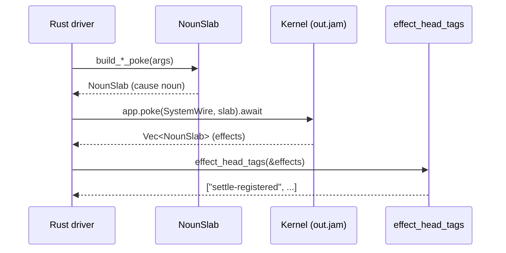

# The Rust driver

The driver is the Rust side of your nockapp — the program in `src/main.rs` that boots `out.jam` as a `NockApp`, sends pokes, and reads effects back. Most of the noun construction is done for you by `vesl-core`'s `build_*_poke` helpers; you write the orchestration.



## The shape of a driver

Boot the kernel via `nockapp::kernel::boot::setup`, then pump pokes against the resulting `NockApp`. The full 30-line driver from the [quickstart](/setup/quickstart#6-exercise-the-lifecycle) is the canonical shape. For a forkable thin harness — kernel boot plus a `/commit` / `/verify` HTTP shell and `vesl.toml` config — see vesl-core's `hull/` template, covered on [Going deeper / vesl-core](/going-deeper/vesl-core).

## Poke builders

`vesl-core` ships one `build_*_poke` helper per shipped graft cause. Each takes typed Rust primitives in and returns a ready-to-poke `NounSlab` out:

```rust
use vesl_core::{Mint, Tip5Hash, build_settle_register_poke, build_settle_note_poke};

let mut mint = Mint::new();
let root: Tip5Hash = mint.commit(&[b"first"]);

let register = build_settle_register_poke(1, &root);
let note     = build_settle_note_poke(1, 1, &root, b"first");
```

The full set covers settle, mint, guard, forge, plus state and behavior grafts (`build_kv_set_poke`, `build_counter_inc_poke`, `build_log_append_poke`, etc.). See [`crates/vesl-core/src/lib.rs`](https://github.com/zkvesl/vesl-core/blob/11d110d/crates/vesl-core/src/lib.rs#L1-L40) for the entry-point map.

For grafts that store structured data (`registry`, `log`, `queue`, `batch`), use the paired `_from_noun` helper to jam the payload internally rather than passing a raw `&[u8]`:

```rust
let mut record = NounSlab::new();
record.set_root(your_noun);
let slab = build_registry_put_poke_from_noun(key, &record);
```

The byte-taking variants (`build_registry_put_poke(key, &jammed_bytes)`) trust the caller to have already jammed the payload.

## Sending pokes

```rust
let effects = app.poke(SystemWire.to_wire(), slab).await?;
```

`SystemWire` is the standard wire identity for system-level pokes. The poke is async; `app.poke` returns `Vec<NounSlab>` — the kernel's effect list, one effect per element.

## Parsing effects

```rust
for tag in vesl_core::effect_head_tags(&effects) {
    println!("  effect: %{tag}");
}
```

`effect_head_tags` walks each effect noun and pulls the head atom as a string. For typed effect decoding beyond the head tag, see `vesl_core::effect_head_tag` (singular) and the per-graft `decode_*_effect` helpers in the source.

## Driver/kernel drift detection

Each shipped scaffold's `build.rs` runs `graft-inject codegen kernel-cause-tags` after `hoonc` and writes `kernel_cause_tags.rs` into `OUT_DIR`. The path is exposed as the `KERNEL_CAUSE_TAGS_PATH` env var. Pull it into your driver and gate poke construction on a const-time membership check:

```rust
include!(env!("KERNEL_CAUSE_TAGS_PATH"));

fn build_settle_register_poke(hull: u64, root: &Tip5Hash) -> NounSlab {
    assert_kernel_cause_tag!("settle-register");
    // ... construct the noun ...
}
```

`assert_kernel_cause_tag!` runs at compile time. A kernel rename (e.g. `%settle-register` → `%settle-write`) without re-running the codegen now fails `cargo build` at the macro invocation, surfacing the drift as a compile error rather than a silent `Ok(vec![])` from `app.poke(...)` at runtime.

`KERNEL_CAUSE_TAGS` is derived from the literal `+$ cause` definition in `app.hoon`, not from the union of every `--lib-dir` manifest. Two consequences:

- **Domain causes are covered.** Inline variants you added directly to your domain (`%submit-artifact`, `%emit-license`, etc.) show up in `KERNEL_CAUSE_TAGS`. `assert_kernel_cause_tag!("submit-artifact")` compiles. Kernel rename → driver compile error, same way as graft-side renames.
- **Inactive grafts contribute nothing.** A graft sitting under `hoon/lib/` but never referenced from `+$ cause $%(...)` doesn't pollute the slice with its tags.

If `graft-inject` isn't installed in the build environment, the codegen step emits a `cargo:warning` and leaves `KERNEL_CAUSE_TAGS_PATH` unset — drivers that gate the include on `cfg(env_var = "KERNEL_CAUSE_TAGS_PATH")` continue to build. Drift detection is opt-in per driver.

## Hand-rolled causes

When you have a domain cause without a builder yet, construct the noun manually:

```rust
use nockapp::{AtomExt, Bytes, NockApp, noun::slab::NounSlab, wire::{SystemWire, Wire}};
use nockvm::noun::{Atom, T};
use nock_noun_rs::atom_from_u64;

async fn issue_badge(app: &mut NockApp, subject: u64) -> anyhow::Result<()> {
    let mut slab = NounSlab::new();
    let tag  = Atom::from_bytes(&mut slab, &Bytes::copy_from_slice(b"issue-badge")).as_noun();
    let subj = atom_from_u64(&mut slab, subject);
    let noun = T(&mut slab, &[tag, subj]);
    slab.set_root(noun);
    let _ = app.poke(SystemWire.to_wire(), slab).await?;
    Ok(())
}
```

The pattern generalizes: one atom per cause field, then `T(&mut slab, &[tag, arg1, arg2, ...])`.

## The four noun footguns

The four rules `nock-noun-rs` exists to handle. Read [`nock-noun-rs/README.md`](https://github.com/zkvesl/vesl-core/blob/main/crates/nock-noun-rs/README.md) for the full exposition; the short list:

- **Long tags** (> 8 bytes) panic at compile time under `D(tas!(b"…"))`. Use `Atom::from_bytes(slab, &Bytes::copy_from_slice(b"…"))` for anything from `settle-register` upward.
- **Wide `u64` values** (hashes, IDs where the top bit may be set) panic at runtime under `D(value)` with `Number is greater than DIRECT_MAX`. Route them through `atom_from_u64(slab, value)`.
- **`AtomExt::from_bytes` takes `&bytes::Bytes`**, not `&[u8]` — via the `nockapp::Bytes` re-export.
- **Loobeans are inverted relative to Rust booleans.** Hoon's `%.y` (yes) is atom `0`; `%.n` (no) is atom `1`. Convert at the boundary, not inline.

## See also

- [vesl-nockup README — Step 6 driver](https://github.com/zkvesl/vesl-nockup/blob/6e2127c/README.md#L246-L300) — the canonical 30-line driver, SHA-pinned.
- [`tools/graft-inject/tests/mint_lifecycle.rs`](https://github.com/zkvesl/vesl-nockup/blob/6e2127c/tools/graft-inject/tests/mint_lifecycle.rs) — full lifecycle as a Rust integration test.
- [`crates/vesl-core/src/lib.rs`](https://github.com/zkvesl/vesl-core/blob/11d110d/crates/vesl-core/src/lib.rs#L1-L40) — the four primitives and the poke-builder map.
