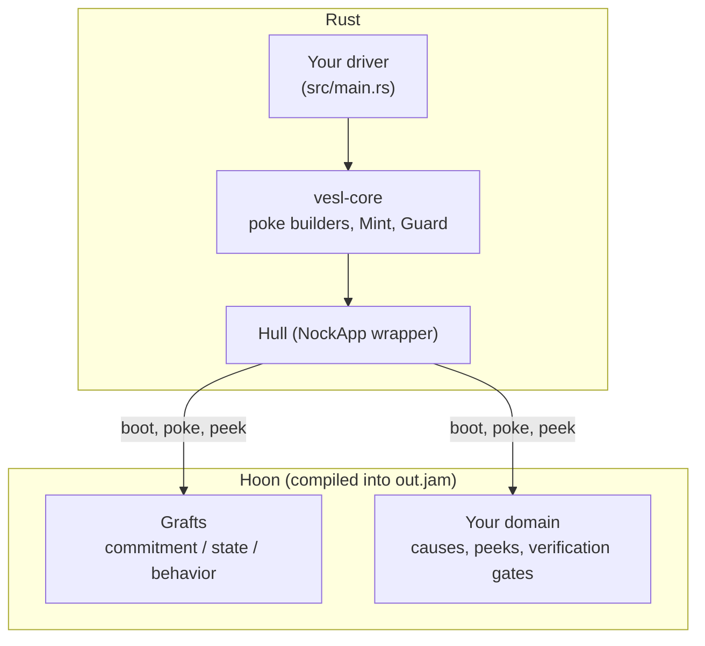

# Shape of a nockapp

A nockapp is a compiled Hoon kernel (`out.jam`) booted inside a Rust driver. The driver sends pokes; the kernel returns effects. vesl supplies most of the kernel as a graft library and gives you a CLI that splices those grafts into the source you compile.

## The three layers



**Hull** — a Rust harness that boots the kernel and mediates I/O. **Grafts** — a Hoon library installed into `hoon/lib/` and composed into your kernel at `::  nockup:*` marker comments. **Your domain** — the cause tags, peek paths, and verification gates you write between the markers.

## The hull

The hull is the Rust process that hosts the kernel. It boots the compiled JAM as an embedded `NockApp`, routes inbound requests into pokes and peeks, and surfaces effects back to the caller. The kernel is pure logic; the hull does the I/O — HTTP, the chain client, the filesystem, persistent checkpoints.

In a vesl nockapp, the hull is whatever your `src/main.rs` builds with `nockapp::kernel::boot::setup`. The [Rust driver](/build/rust-driver) page covers the canonical shape; for a thin reference harness, [vesl-core](https://github.com/zkvesl/vesl-core) ships a `hull/` template with kernel boot and `/commit` / `/verify` endpoints — fork it when you want a generic process around a vesl kernel.

## Grafts

Grafts are pre-written Hoon libraries that ship as `<name>-graft.hoon` plus a sibling `<name>-graft.toml` manifest. Each manifest declares blocks of Hoon code keyed to specific marker comments — imports, state fields, cause-union variants, poke arms, peek arms, effect variants. `graft-inject` discovers manifests under `hoon/lib/`, splices their blocks into your `app.hoon` at the markers, and writes the result.

Thirteen grafts ship today across four families plus a placeholder:

- **Commitment** — `settle-graft`, `mint-graft`, `guard-graft`, `forge-graft`. Merkle trees, root registration, payload verification, STARK proving.
- **State** — `kv-graft`, `counter-graft`, `queue-graft`, `rbac-graft`, `registry-graft`. Domain-keyed state primitives.
- **Behavior** — `validate-graft`, `log-graft`, `clock-graft`, `batch-graft`. Pre-flight checks, audit trail, deterministic clock, settlement-flush buffer.
- **Intent (placeholder)** — `intent-graft`. Reserved for multi-party coordination; crashes on invocation until upstream lands.

[Install grafts](/build/install-grafts) covers the family taxonomy with priority bands.

## Your domain

You write a small amount of Hoon between the markers — typically: one or two custom causes (`[%my-action ...]`) in `nockup:cause`, the `?-` arms that handle them in `nockup:poke`, optional custom peek paths in `nockup:peek`, and the contents of `nockup:domain-effect`. You can also replace the default hash-comparison verification gate with a Merkle-manifest, signature, or STARK gate by passing it through `[graft.gates]` in a graft manifest.

The marker template at [`templates/app.hoon`](https://github.com/zkvesl/vesl-nockup/blob/6e2127c/templates/app.hoon) is 89 lines; the nine `::  nockup:*` markers are pre-placed at the right structural points. Copy it over the nockup `basic` scaffold's `app.hoon` once; do not edit it back to the basic shape afterwards. See [Write the kernel (Hoon)](/build/kernel-hoon) for concrete patterns.

## How they compose

```
my-app/
├── Cargo.toml          # path deps + [patch] blocks
├── build.rs            # no-op (hoonc runs in Step 4)
├── src/main.rs         # your driver
├── hoon/
│   ├── app/app.hoon    # marker template + grafts + your domain
│   ├── lib/            # graft libraries (.hoon + .toml manifests)
│   └── common/         # shared libs (zeke.hoon, ztd/, ...)
└── out.jam             # compiled kernel (after hoonc)
```

`graft-inject inject --apply hoon/app/app.hoon` splices graft blocks into the source file at the markers; `hoonc` compiles the result to `out.jam`; the driver loads it via `boot::setup`. The CLI is preview-by-default (the supply-chain guardrail described in [Wire with graft-inject](/build/wire)); nothing lands on disk until you pass `--apply`.

## What's deterministic and why

Nock is [nockchain](https://github.com/nockchain/nockchain)'s combinator calculus, JAM is its serialization format, and the deterministic interpreter that gives a kernel exactly one possible output for any given input is part of the nockchain runtime. STARK proving (used by `forge-graft`) is also nockchain's stack — `vesl-prover.hoon` and the constraint tables under `hoon/dat/` ride on the upstream prover. vesl runs a Hoon kernel inside the nockchain `NockApp` and ships a graft library and a CLI on top: it does not invent determinism, proving, or the noun model.

The vesl-core entry types (`Mint`, `Guard`, the four primitives) are documented at [`crates/vesl-core/src/lib.rs#L1-L40`](https://github.com/zkvesl/vesl-core/blob/11d110d/crates/vesl-core/src/lib.rs#L1-L40); start there if you want to read source.
