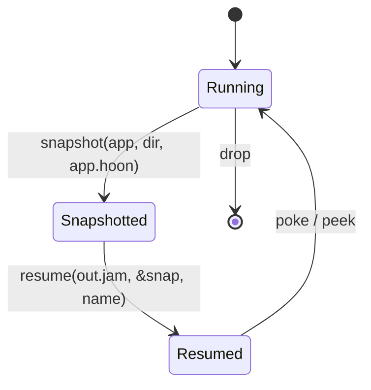

# State & Snapshots

Kernel state lives inside the compiled `out.jam` and changes one poke at a time. When you need to upgrade the kernel — adding a graft, fixing a transition bug, retuning a verification gate — you snapshot the current state, recompile, and rehydrate.



## State Lives in the Kernel

Each graft contributes one or more fields to `+$ versioned-state` at the `::  nockup:state` marker. Your domain adds its own fields between or after them. The kernel reads/writes `state` inside every `?-` arm; nothing else holds it.

For commitment grafts the canonical state shape is `settle-state`:

```hoon
+$  settle-state
  $:  epoch=@                     ::  current epoch number
      registered=(map @ @)        ::  hull-id -> merkle-root
      settled=(set @)             ::  current-epoch note-ids (replay protection)
      settle-count=@              ::  notes settled in current epoch
      prior-settled=(set @)       ::  previous epoch's set (kept for lookback)
  ==
```

The `epoch` / `settle-count` / `prior-settled` fields support count-based rotation — the settled set rotates after 1M settles per epoch, keeping a two-epoch lookback window for replay detection.

## Snapshot a Kernel

```rust
use vesl_checkpoint::{snapshot, resume};

let mut harness = GraftTestHarness::boot("out.jam").await?;
harness.register(1, &root).await?;

let snap_dir = std::path::Path::new("snapshots/before-mint-graft");
let snap = snapshot(harness.app(), snap_dir, "hoon/app/app.hoon").await?;
drop(harness);
```

Bundle layout written to disk:

```
snapshots/before-mint-graft/
├── state.jam   (bincode-encoded ExportedState — same format
│                that nockapp::Cli::state_jam accepts on import)
└── meta.toml   ([snapshot] source_sha256, timestamp,
                 vesl_checkpoint_version)
```

## Resume a Kernel

```rust
let resumed = resume("out.jam", &snap, "after-mint-graft").await?;

let peek_path = vesl_core::build_hull_peek_path("settle-root", 1);
let result = resumed.peek(peek_path).await?;
let stored_root = vesl_core::unwrap_triple_unit_atom(&result);
assert_eq!(stored_root.as_deref(), Some(&root_bytes[..]));
```

## Same-Composition Resume

The new kernel has the same set of grafts as the snapshot. State roundtrips cleanly — both pre- and post-resume pokes emit effects. State is reset to per-graft defaults on every resume; operators who need data preservation re-poke after resume.

## Schema-Extension Resume

The new kernel adds grafts that weren't in the snapshot. `nockup graft` codegen at the `::  nockup:load-defaults` marker emits a `=/ defaults ^*(versioned-state)` + `%_ defaults <field> ^*(<field>-state) ... ==` overlay so resumed snapshots with a smaller noun shape get type defaults at the new graft axes instead of panicking inside the wrapper's mule guard.

The earlier identity-load placeholder silently dropped effects on every graft past the first added priority band; the defaults-overlay codegen replaces that placeholder.

## Recomposition That Requires Manual Migration

Snapshots are tied to a kernel composition. Adding a graft is handled by the defaults overlay; removing one or changing a state field's shape is not. The schema-migration helper is intentionally out of scope — you re-poke after resume to set up the desired state, or migrate state out of the old kernel and into the new via a domain peek/poke round-trip.

## The Trellis Pattern

When one app needs to split commitments across multiple namespaces — different tenants, different versions, different audit periods — `settle-graft`'s `registered=(map @ @)` already supports it. Pick a scheme for `hull-id` and use it. Each `hull-id` keys a distinct root with its own `register` / `verify` / `note` lifecycle; `settled ∪ prior-settled` is global across the trellis, so note-ids are unique kernel-wide. Where per-hull note-id namespaces are needed, hash `note-id = hash(hull, local-id)` on the caller side before sending.

The trellis gives the isolation of separate kernels without booting separate `NockApp`s. `hull-id` is the only axis needed.

## See Also

- [vesl-nockup README — State checkpoints](https://github.com/zkvesl/vesl-nockup/blob/main/README.md#state-checkpoints)
- [`tools/graft-inject/tests/checkpoint_lifecycle.rs`](https://github.com/zkvesl/vesl-nockup/blob/6e2127c/tools/graft-inject/tests/checkpoint_lifecycle.rs) — state survives same-composition resume modulo the defaults overlay.
- [`crates/vesl-checkpoint/tests/end_to_end.rs`](https://github.com/zkvesl/vesl-core/blob/11d110d/crates/vesl-checkpoint/tests/end_to_end.rs) — full snapshot + resume lifecycle in vesl-core.
