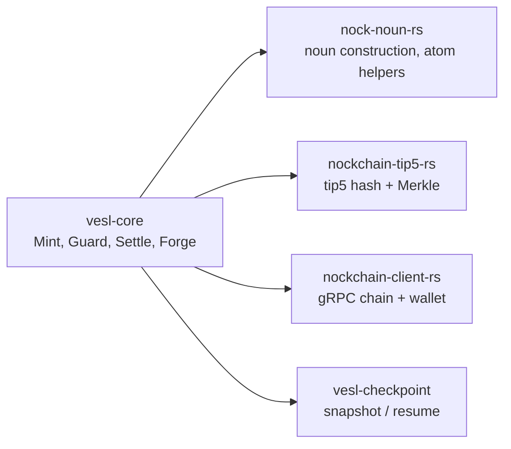

# vesl-core

`vesl-core` is the Rust SDK that ships under [zkvesl/vesl-core](https://github.com/zkvesl/vesl-core). vesl-nockup re-exports the parts a typical app uses through the `vesl-core` Cargo dep; this page is for when you want to drop below that and read or fork the SDK directly.

::: tip Scope
This page is a navigable orientation, not a full vesl-core reference. The canonical API surface lives in rustdoc; the canonical worked examples live in the vesl-core README and the four crate READMEs linked below.
:::

::: tip Building rustdoc locally
From a vesl-core or vesl-nockup checkout, `cargo doc --open -p vesl-core` builds and opens the SDK's rustdoc. Use `-p vesl-checkpoint`, `-p vesl-signing`, `-p nockchain-tip5-rs`, or `-p nock-noun-rs` for the sibling crates. No hosted-docs URL ships today.
:::

## What's in the Crate

Four primitives, each a different weight class. The lib.rs module-level comment names them and is the authoritative entry point:

- **Mint** — Data commitment. Pure math, zero async. Commit chunks, get a root.
- **Guard** — Verification. Prove chunks and manifests against trusted roots.
- **Settle** — Settlement. Kernel boot + chain access for note state transitions.
- **Forge** — STARK proof. Everything Settle does, plus proof generation.

Read [`crates/vesl-core/src/lib.rs#L1-L40`](https://github.com/zkvesl/vesl-core/blob/11d110d/crates/vesl-core/src/lib.rs#L1-L40) for the entry-point list and the top-level re-exports.

## When You Reach for vesl-core Directly

Most vesl-nockup users never touch vesl-core directly — the `build_*_poke` helpers in `vesl-core::graft_pokes` are re-exported as the high-level API. You drop into vesl-core when:

- Contributing a fix or feature to the SDK itself.
- Embedding `Mint` or `Guard` without booting a kernel (pure-math use cases).
- Writing a custom verification gate that needs the noun marshalling primitives.
- Using snapshot/resume across more than the canonical defaults overlay.
- Driving an alternative settlement flow against `chain-client-rs`.

If you're staying in vesl-nockup, you almost never need this page — go to [Build / Hull](/build/hull) instead.

## The Four Sibling Crates



```
vesl-core/crates/
├── vesl-core/                 # the SDK facade — Mint, Guard, Settle, Forge
├── nock-noun-rs/              # noun construction (the four footguns)
├── nockchain-tip5-rs/         # tip5 Merkle primitives
├── nockchain-client-rs/       # gRPC chain client + wallet
└── vesl-checkpoint/           # snapshot/resume bundle types
```

Crate READMEs (each is the authoritative single-page intro for that crate):

- [`vesl-core/README.md`](https://github.com/zkvesl/vesl-core/blob/main/README.md) — workspace overview, the EVM ↔ Nockchain mapping, settlement modes, quick-start branching.
- [`nock-noun-rs/README.md`](https://github.com/zkvesl/vesl-core/blob/main/crates/nock-noun-rs/README.md) — the four noun footguns (loobeans inverted, cords are atoms, lists null-terminated, `DIRECT_MAX` panic) and the memory model.
- [`nockchain-tip5-rs/README.md`](https://github.com/zkvesl/vesl-core/blob/main/crates/nockchain-tip5-rs/README.md) — alignment, leaf vs. pair hashing, cross-runtime guarantees, test vectors.
- [`nockchain-client-rs/README.md`](https://github.com/zkvesl/vesl-core/blob/main/crates/nockchain-client-rs/README.md) — gRPC architecture, balance queries, NoteData encoding.
- [`vesl-checkpoint/README.md`](https://github.com/zkvesl/vesl-core/blob/main/crates/vesl-checkpoint/README.md) — snapshot bundle layout, same-composition vs. schema-extension resume.

## The Poke-Builder Family

`vesl-core::graft_pokes` ships one `build_*_poke` helper per shipped graft cause. The full set covers settle (`build_settle_register_poke`, `build_settle_verify_poke`, `build_settle_note_poke`), mint, guard, forge, plus state and behavior grafts (`build_kv_set_poke`, `build_counter_inc_poke`, `build_log_append_poke`, `build_queue_push_poke`, `build_rbac_grant_poke`, `build_registry_put_poke`, `build_validate_init_poke`, `build_clock_tick_poke`, `build_batch_add_poke`).

For grafts that store structured data (`registry`, `log`, `queue`, `batch`), each builder also has a `_from_noun` paired form that jams the payload internally. See [Build / Hull — poke builders](/build/hull#poke-builders).

## Catalog Gates from Rust

The five named verification gates in `vesl-gates.hoon` (ed25519, Schnorr, manifest, set-membership, bounded-value) are selectable per-graft via `[graft.gates]` in a manifest, but the Rust side that drives them needs to construct cryptographically-valid payloads. [Build / Catalog Gates from Rust](/build/catalog-gates) walks the Schnorr signing flow end-to-end (build a payload, sign with `vesl-core::signing`, hash via tip5, register the root, settle a note that pre-commits to the signed payload).

## Guard Lifecycle

`Guard` is the pure-math verification surface — register trusted roots, then check chunks or full manifests against them. No kernel involvement.

```rust
// Example: register a root, verify a leaf, manifest-check a bundle
use vesl_core::{Mint, Guard};

let mut mint = Mint::new();
let chunks: &[&[u8]] = &[b"alpha", b"beta", b"gamma"];
let root = mint.commit(chunks);
let proof = mint.proof(0).unwrap();

let mut guard = Guard::new();
guard.register_root(root)?;

assert!(guard.check(b"alpha", &proof, &root));
assert!(!guard.check(b"tampered", &proof, &root));
```

The full API:

- `Guard::new() -> Self` — empty, no trusted roots.
- `register_root(&mut self, root: Tip5Hash) -> Result<(), GuardError>` — trust a root. Errors with `CapacityExceeded` past `MAX_ROOTS` (10,000).
- `revoke_root(&mut self, root: &Tip5Hash) -> bool` — drop a root; returns whether it was present.
- `is_registered(&self, root: &Tip5Hash) -> bool` — membership check.
- `check(&self, data: &[u8], proof: &[ProofNode], root: &Tip5Hash) -> bool` — verify one chunk.
- `check_with_reason(...) -> Result<(), String>` — same as `check` with a human-readable error on failure.
- `check_manifest(&self, manifest: &Manifest, root: &Tip5Hash) -> bool` — verify every chunk in a `Manifest` plus the reconstructed prompt against the root.
- `validate_manifest(...) -> Result<(), String>` — same with structured error.

The source is at [`crates/vesl-core/src/guard.rs`](https://github.com/zkvesl/vesl-core/blob/11d110d/crates/vesl-core/src/guard.rs).

## Signing Helpers

`vesl-core::signing` ships the Schnorr key derivation and signing primitives the catalog gates expect on payloads:

- `derive_pubkey(sk: &[Belt; 8]) -> SchnorrPubkey` — public key from a secret key.
- `pubkey_hash(pk: &SchnorrPubkey) -> Hash` — `hash-leaf(pubkey)`, the `expected-root` shape `sig-verify-{schnorr,ed25519}` enforces.
- `pubkey_canonical_bytes(pk: &SchnorrPubkey) -> Vec<u8>` — serialized affine point (`ser-a-pt:cheetah`), the wallet-export shape.
- `pack_schnorr_signature(sig: &SchnorrSignature) -> Vec<u8>` — wire-form `(chal << 256) | s`.
- `schnorr_message_digest_for_data(data: &[u8]) -> [Belt; 5]` — tip5 digest of payload bytes, the canonical message for `sign`.
- `sign(sk: &[Belt; 8], message: &[Belt; 5]) -> Result<SchnorrSignature, SigningError>` — Schnorr sign over the message digest.
- `key_from_seed_phrase(phrase: &str) -> Result<[Belt; 8], SigningError>` — BIP-39 mnemonic to secret key.

These compose end-to-end with `build_settle_note_schnorr_poke`, which takes the `SchnorrSignature` and `SchnorrPubkey` directly. The end-to-end gate-driving walkthrough is on [Build / Catalog Gates from Rust](/build/catalog-gates). Source is at [`crates/vesl-core/src/signing.rs`](https://github.com/zkvesl/vesl-core/blob/11d110d/crates/vesl-core/src/signing.rs).

## Driving rbac-graft

rbac-graft maps `pubkey:@ → list<perm:@t>` in kernel state. Two pokes mutate it:

```rust
// Example: grant + revoke
use vesl_core::{build_rbac_grant_poke, build_rbac_revoke_poke};

let grant  = build_rbac_grant_poke(42, &["publish", "approve"]);
let revoke = build_rbac_revoke_poke(42, &["approve"]);
```

The `%rbac-has-perm` peek is a two-arg path (`[%rbac-has-perm pubkey=@ perm=@t ~]`). The shipped peek-path helpers cover one-arg shapes only, so build the slab by hand:

```rust
// Example: hand-rolled rbac peek path
use nock_noun_rs::{atom_from_u64, make_tag_in, NounSlab};
use nockvm::noun::{D, T};

fn build_rbac_has_perm_path(pubkey: u64, perm: &str) -> NounSlab {
    let mut slab = NounSlab::new();
    let tag = make_tag_in(&mut slab, "rbac-has-perm");
    let pk = atom_from_u64(&mut slab, pubkey);
    let p = make_tag_in(&mut slab, perm);
    let path = T(&mut slab, &[tag, pk, p, D(0)]);
    slab.set_root(path);
    slab
}
```

Decode the result with `peek_loobean(&result) -> Option<bool>`, not with `unwrap_triple_unit_atom` — the latter collapses atom-0 (`%.y`) onto the absent-value boundary.

The typical orchestrator-side shape peeks `%rbac-has-perm` before submitting a downstream poke; a `Some(false)` short-circuits the request before any kernel work. The denial is silent (no poke means no effect). [Troubleshooting / Distinguishing Denial Paths](/troubleshooting/common-pitfalls#distinguishing-denial-paths) covers how this reads against gate-deny, gate-crash, and validate-prelude denials.

The path is a multi-arg list, hand-constructed (no `build_*` helper today). See [Kernel → Domain Peeks → Multi-Arg Path](/build/kernel/peeks#multi-arg-path) for the kernel side of the same pattern and [Hull → Peek-Then-Poke Gating](/build/hull#peek-then-poke-gating) for the orchestrator-side use as an admission check.

## Driving validate-graft

validate-graft is a runtime-configured pre-flight rule checker. Rules install per cause-tag via `%validate-init`; the prelude block shorts every poke whose cause-tag has installed rules that fail.

```rust
// Example: install a non-empty rule on %counter-set, then clear it
use vesl_core::{build_validate_init_poke, build_validate_clear_poke, ValidateRule};

let install = build_validate_init_poke("counter-set", &[ValidateRule::NonEmpty]);
let clear   = build_validate_clear_poke("counter-set");
// app.poke(install) emits [%validate-rules-installed cause-tag=counter-set count=1]
// app.poke(clear)   emits [%validate-rules-cleared cause-tag=counter-set]
```

The v0.1 `Rule` enum ships one variant: `NonEmpty` (cause body must not be `~`). Additional variants (Length, InSet, Range, UniqueIn) are reserved tags in the Hoon-side union for v0.2 and will appear on `ValidateRule` as the corresponding Hoon support lands.

A poke whose cause-tag has rules and fails any rule short-circuits at the prelude and emits `[%validate-rejected cause-tag=@ta reason=@t]`. Pokes whose rules pass (or whose cause-tag has no installed rules) flow through to the normal arm.

## Committing Over Graft State

When a domain arm anchors a Merkle root over another graft's state (e.g. snapshot `registry-graft`'s vault map for off-kernel proof), the pattern is: read the graft state, jam each entry to a leaf, mint a root, then drive `%mint-commit` against the result.

```hoon
::  Example: a %snapshot-vault arm in your kernel
  %snapshot-vault
=/  vault  ~(tap by registry.state)
=/  leaves
  %+  turn  vault
  |=([key=@ payload=@] (jam [key payload]))
::  Hand `leaves` back to the hull via a pending effect; the hull mints
::  the root and re-pokes %mint-commit.
:_  state
~[[%domain-snapshot-pending ~]]
```

```rust
// Example: hull side, receive %domain-snapshot-pending then commit
use vesl_core::{Mint, build_mint_commit_poke};

let leaves: Vec<&[u8]> = jammed_entries.iter().map(|e| e.as_slice()).collect();
let mut mint = Mint::new();
let root = mint.commit(&leaves);
let poke = build_mint_commit_poke(hull, &root);
let _ = app.poke(SystemWire.to_wire(), poke).await?;
```

**Snapshot temporal staleness.** The root commits to registry state at the moment `~(tap by registry.state)` runs. Pokes that mutate `registry` between commit and a consumer's verification observe a different state. Treat the root as a *snapshot* identifier, not a *current-state* identifier: queries against the committed leaves answer "this entry was present when the snapshot was minted," not "this entry is present now." Operators who need fresh roots commit again after each batch of mutations.

## Where to Read Source

The directory tour for someone diving in:

- [`crates/vesl-core/src/lib.rs`](https://github.com/zkvesl/vesl-core/blob/11d110d/crates/vesl-core/src/lib.rs#L1-L40) — module map and re-exports.
- `crates/vesl-core/src/graft_pokes/` — one file per shipped graft's poke builders.
- `crates/vesl-core/src/peek.rs` — `effect_head_tags`, `unwrap_triple_unit_atom`, `build_hull_peek_path`, and the typed-effect decoders.
- `crates/vesl-core/src/signing.rs` — Schnorr key derivation, Ed25519 signature helpers; consumed by `vesl-signing` (BIP-39/BIP-44).
- `crates/vesl-core/src/types.rs` — `Tip5Hash`, `ProofNode`, `Manifest`, `Note`, `NoteState`, `MerkleTree`, the chain config types.
- `kernels/{guard,mint,settle}/` — thin crates that `include_bytes!` the committed `.jam` and sha256-verify at boot to detect tampering between build and link.

## Snapshot / Resume

`vesl-checkpoint::snapshot()` and `resume()` wrap the underlying `nockapp` export/import path with a typed snapshot bundle (state.jam + meta.toml). [Build / State & Snapshots](/build/state-snapshots) covers the workflow; the canonical end-to-end is at [`crates/vesl-checkpoint/tests/end_to_end.rs`](https://github.com/zkvesl/vesl-core/blob/11d110d/crates/vesl-checkpoint/tests/end_to_end.rs).

## TOML Role-Toggle

A pattern the SDK uses internally: one TOML file with multiple role sections (e.g., `[wallet]`, `[hull]`); the same code path reads a different section by role to derive a different key or config. The canonical test is [`crates/vesl-core/tests/wallet_toml_e2e.rs`](https://github.com/zkvesl/vesl-core/blob/11d110d/crates/vesl-core/tests/wallet_toml_e2e.rs) — read it when designing config splits across roles in a domain hull.

::: info See Also

- [Build / Hull](/build/hull) — how vesl-core is consumed from a vesl-nockup project.
- [Grafts / Manifest Schema](/build/grafts/manifest-schema) — the manifest format vesl-core's `graft_pokes` builders generate causes for.
- [vesl-core README](https://github.com/zkvesl/vesl-core/blob/main/README.md) — the canonical longer-form orientation.

:::
