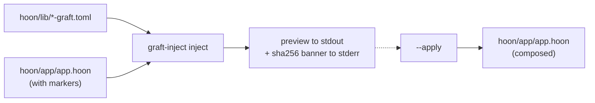

# Wire with graft-inject

`graft-inject` is the CLI that splices Hoon graft libraries into your kernel at the marker comments. It reads `<name>-graft.toml` manifests under `hoon/lib/`, composes the per-marker blocks, and writes the result back into `hoon/app/app.hoon`.



## The composer model

Every graft manifest declares blocks of Hoon code keyed to a marker name (`imports`, `state`, `cause`, `poke`, `peek`, etc.). The marker template in `templates/app.hoon` carries ten anchor comments at the right structural points:

```
templates/app.hoon  (89 lines; 10 anchor comments)
::  nockup:imports          ← graft /+ and /= imports
::  nockup:state            ← per-graft state fragments inside +$ versioned-state
::  nockup:domain-effect    ← your app's effect variants (you write these)
::  nockup:effect-union     ← codegen: the typed effect-union pass writes here
::  nockup:cause            ← graft cause-tag variants
::  nockup:load-defaults    ← codegen: state-shape migration overlay (resume)
::  nockup:peek             ← graft peek arms
::  nockup:poke-prelude     ← pre-flight checks (e.g. validate-graft)
::  nockup:poke             ← graft ?- arms
::  nockup:poke-postlude    ← post-flight observers (e.g. log-graft, batch-graft)
```

`graft-inject inject` walks `hoon/lib/`, reads every `<name>-graft.toml`, and splices each block at its declared marker. The composer is idempotent — re-running after `--apply` skips anything already wired.

## Preview by default

```bash
graft-inject inject hoon/app/app.hoon            # preview
graft-inject inject --apply hoon/app/app.hoon    # write
```

A bare invocation prints the composed kernel to stdout and a per-manifest sha256 summary to stderr. Nothing is written until you pass `--apply`. This keeps a compromised `hoon/lib/` — pulled by sync, a bad `cp`, or a dependency bump — from silently composing hostile Hoon into your kernel source. The supply-chain trust model lives in [Reference / Graft manifest schema](/reference/graft-manifest).

## Selective composition

```bash
graft-inject list                                                              # see what's available
graft-inject inject --grafts settle-graft,mint-graft --apply hoon/app/app.hoon # explicit subset
graft-inject inject --exclude intent-graft --apply hoon/app/app.hoon           # everything but the intent placeholder
```

## Pre-apply linting

`graft-inject lint <app.hoon>` runs read-only structural validations. Exit code is `1` on any finding so CI can gate `--apply` on the lint passing. Pass `--json` for a stable machine-readable schema. Four lint families ship today:

- **`bare-tilde-ambiguity`** — flags domain `?-` switch arms whose body ends with a `~`-only line. The peek-chain rebuilder would otherwise mistake that `~` for the chain terminator and corrupt the file. Refactor to `` `(list effect)`~ `` or `^- (list effect) ~` on a single line.
- **`collision-check`** — flags duplicate cause-tag names and state-field names across grafts and between grafts and your domain. Cross-references manifest declarations against the domain `nockup:cause` / `nockup:state` regions. Surfaces collisions at scaffold time rather than at hoonc nest-fail time.
- **`transitive-imports`** — walks every `.hoon` reachable from `<app.hoon>` via `/+`, `/=`, `/-`, `/#` imports AND eagerly scans every `.hoon` under `hoon/common/`. Reports each unsatisfied edge with source file, import token, expected target, and the BFS chain. hoonc eager-parses `hoon/common/` regardless of import-graph reachability, and unsatisfied edges there leave hoonc exit 0 with no `out.jam` (the silent-fail case from [Build & run](/build/build-run)).
- **`internal-dupes`** — flags literal duplicate variant heads in the composed `+$ cause $%(...)` union and literal duplicate field names in `+$ versioned-state $:(...)`. Differs from `collision-check` by scanning the post-injection source unions, so duplicates that surface only after composition (e.g. two grafts contributing the same head despite distinct manifest names) get caught here.

## What got composed

After `--apply`, the per-manifest sha256 summary on stderr looks like:

```
graft-inject: hoon/app/app.hoon
  settle-graft     sha256:a9c72bbe7dc1 injected 5/5 (imports, state, cause, poke, peek)
  mint-graft       sha256:4b2e...       injected 5/5 (imports, state, cause, poke, peek)
  guard-graft      sha256:c310...       injected 5/5 (imports, state, cause, poke, peek)
  forge-graft      sha256:f721...       injected 3/3 (imports, cause, poke)
  markers in source: 10
  markers populated: 5 (imports, state, cause, poke, peek)
```

`forge-graft` ships three blocks (no state, no peek — forge is stateless). The denominator is per-graft: each graft reports against the blocks *it* declares, not a fixed total.

The arms `graft-inject` installs for the four commitment grafts use a default hash-comparison verification gate: the kernel tip5-hashes the raw payload and checks it against the registered root. That's enough for single-leaf commitments. For Merkle manifests, signatures, or STARK gates, see [Write the kernel (Hoon)](/build/kernel-hoon) and [Reference / Graft manifest schema](/reference/graft-manifest).

## See also

- [vesl-nockup README — Step 3](https://github.com/zkvesl/vesl-nockup/blob/main/README.md#step-3--wire-the-kernel)
- [`tools/graft-inject/src/main.rs`](https://github.com/zkvesl/vesl-nockup/blob/6e2127c/tools/graft-inject/src/main.rs) — manifest loader and composer.
- [`templates/app.hoon`](https://github.com/zkvesl/vesl-nockup/blob/6e2127c/templates/app.hoon) — the marker template the composer wires against.
