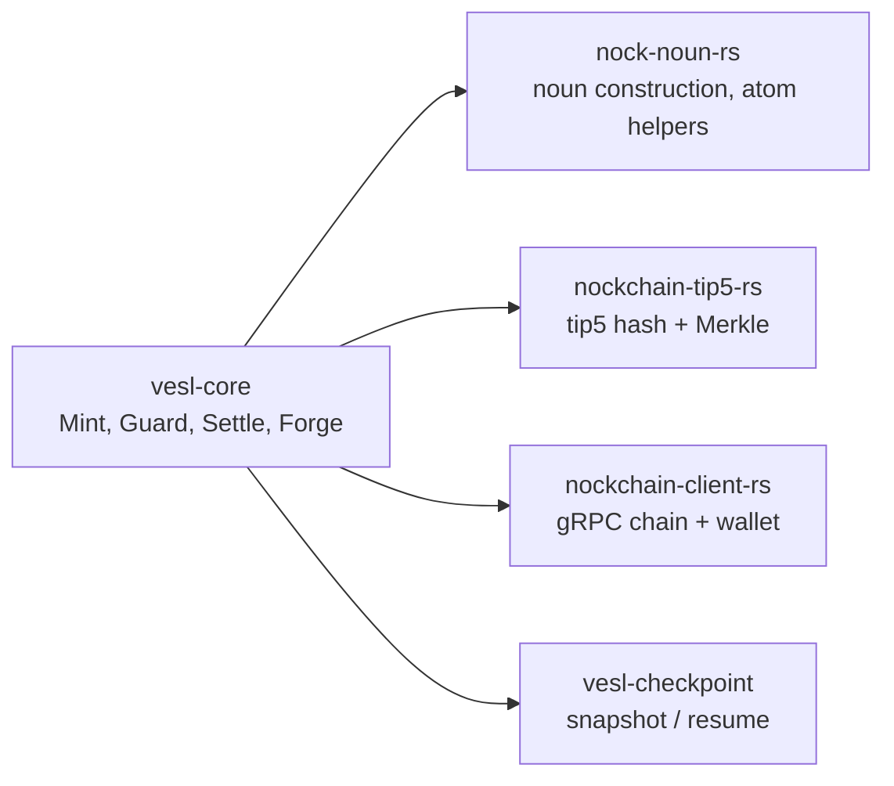

# vesl-core

`vesl-core` is the Rust SDK that ships under [zkvesl/vesl-core](https://github.com/zkvesl/vesl-core). vesl-nockup re-exports the parts a typical app uses through the `vesl-core` Cargo dep; this page is for when you want to drop below that and read or fork the SDK directly.

::: tip Scope
This page is a navigable orientation, not a full vesl-core reference. The canonical API surface lives in rustdoc; the canonical worked examples live in the vesl-core README and the four crate READMEs linked below.
:::

## What's in the crate

Four primitives, each a different weight class. The lib.rs module-level comment names them and is the authoritative entry point:

- **Mint** — Data commitment. Pure math, zero async. Commit chunks, get a root.
- **Guard** — Verification. Prove chunks and manifests against trusted roots.
- **Settle** — Settlement. Kernel boot + chain access for note state transitions.
- **Forge** — STARK proof. Everything Settle does, plus proof generation.

Read [`crates/vesl-core/src/lib.rs#L1-L40`](https://github.com/zkvesl/vesl-core/blob/11d110d/crates/vesl-core/src/lib.rs#L1-L40) for the entry-point list and the top-level re-exports.

## When you reach for vesl-core directly

Most vesl-nockup users never touch vesl-core directly — the `build_*_poke` helpers in `vesl-core::graft_pokes` are re-exported as the high-level API. You drop into vesl-core when:

- Contributing a fix or feature to the SDK itself.
- Embedding `Mint` or `Guard` without booting a kernel (pure-math use cases).
- Writing a custom verification gate that needs the noun marshalling primitives.
- Using snapshot/resume across more than the canonical defaults overlay.
- Driving an alternative settlement flow against `chain-client-rs`.

If you're staying in vesl-nockup, you almost never need this page — go to [Build / The Rust driver](/build/rust-driver) instead.

## The four sibling crates



```
vesl-core/crates/
├── vesl-core/                 # the SDK facade — Mint, Guard, Settle, Forge
├── nock-noun-rs/              # noun construction (the four footguns)
├── nockchain-tip5-rs/         # tip5 Merkle primitives
├── nockchain-client-rs/       # gRPC chain client + wallet
└── vesl-checkpoint/           # snapshot/resume bundle types
```

Crate READMEs (each is the authoritative single-page intro for that crate):

- [`vesl-core/README.md`](https://github.com/zkvesl/vesl-core/blob/main/README.md) — workspace overview, the EVM ↔ Nockchain mapping, settlement modes, quick-start branching.
- [`nock-noun-rs/README.md`](https://github.com/zkvesl/vesl-core/blob/main/crates/nock-noun-rs/README.md) — the four noun footguns (loobeans inverted, cords are atoms, lists null-terminated, `DIRECT_MAX` panic) and the memory model.
- [`nockchain-tip5-rs/README.md`](https://github.com/zkvesl/vesl-core/blob/main/crates/nockchain-tip5-rs/README.md) — alignment, leaf vs. pair hashing, cross-runtime guarantees, test vectors.
- [`nockchain-client-rs/README.md`](https://github.com/zkvesl/vesl-core/blob/main/crates/nockchain-client-rs/README.md) — gRPC architecture, balance queries, NoteData encoding.
- [`vesl-checkpoint/README.md`](https://github.com/zkvesl/vesl-core/blob/main/crates/vesl-checkpoint/README.md) — snapshot bundle layout, same-composition vs. schema-extension resume.

## The poke-builder family

`vesl-core::graft_pokes` ships one `build_*_poke` helper per shipped graft cause. The full set covers settle (`build_settle_register_poke`, `build_settle_verify_poke`, `build_settle_note_poke`), mint, guard, forge, plus state and behavior grafts (`build_kv_set_poke`, `build_counter_inc_poke`, `build_log_append_poke`, `build_queue_push_poke`, `build_rbac_grant_poke`, `build_registry_put_poke`, `build_validate_init_poke`, `build_clock_tick_poke`, `build_batch_add_poke`).

For grafts that store structured data (`registry`, `log`, `queue`, `batch`), each builder also has a `_from_noun` paired form that jams the payload internally. See [Build / The Rust driver](/build/rust-driver#poke-builders).

## Catalog gates from Rust

The five named verification gates in `vesl-gates.hoon` (ed25519, Schnorr, manifest, set-membership, bounded-value) are selectable per-graft via `[graft.gates]` in a manifest, but the Rust side that drives them needs to construct cryptographically-valid payloads. The vesl-nockup README's [Drive a catalog gate from Rust](https://github.com/zkvesl/vesl-nockup/blob/main/README.md#drive-a-catalog-gate-from-rust) section walks the Schnorr signing flow end-to-end (build a payload, sign, hash via tip5, register the root, settle a note that pre-commits to the signed payload).

## Where to read source

The directory tour for someone diving in:

- [`crates/vesl-core/src/lib.rs`](https://github.com/zkvesl/vesl-core/blob/11d110d/crates/vesl-core/src/lib.rs#L1-L40) — module map and re-exports.
- `crates/vesl-core/src/graft_pokes/` — one file per shipped graft's poke builders.
- `crates/vesl-core/src/peek.rs` — `effect_head_tags`, `unwrap_triple_unit_atom`, `build_hull_peek_path`, and the typed-effect decoders.
- `crates/vesl-core/src/signing.rs` — Schnorr key derivation, Ed25519 signature helpers; consumed by `vesl-signing` (BIP-39/BIP-44).
- `crates/vesl-core/src/types.rs` — `Tip5Hash`, `ProofNode`, `Manifest`, `Note`, `NoteState`, `MerkleTree`, the chain config types.

## Snapshot / resume

`vesl-checkpoint::snapshot()` and `resume()` wrap the underlying `nockapp` export/import path with a typed snapshot bundle (state.jam + meta.toml). [Build / State & snapshots](/build/state-snapshots) covers the workflow; the canonical end-to-end is at [`crates/vesl-checkpoint/tests/end_to_end.rs`](https://github.com/zkvesl/vesl-core/blob/11d110d/crates/vesl-checkpoint/tests/end_to_end.rs).

## TOML role-toggle

A pattern the SDK uses internally: one TOML file with multiple role sections (e.g., `[wallet]`, `[hull]`); the same code path reads a different section by role to derive a different key or config. The canonical test is [`crates/vesl-core/tests/wallet_toml_e2e.rs`](https://github.com/zkvesl/vesl-core/blob/11d110d/crates/vesl-core/tests/wallet_toml_e2e.rs) — read it when designing config splits across roles in a domain hull.

## See also

- [Build / The Rust driver](/build/rust-driver) — how vesl-core is consumed from a vesl-nockup project.
- [Reference / Graft manifest schema](/reference/graft-manifest) — the manifest format vesl-core's `graft_pokes` builders generate causes for.
- [vesl-core README](https://github.com/zkvesl/vesl-core/blob/main/README.md) — the canonical longer-form orientation.
