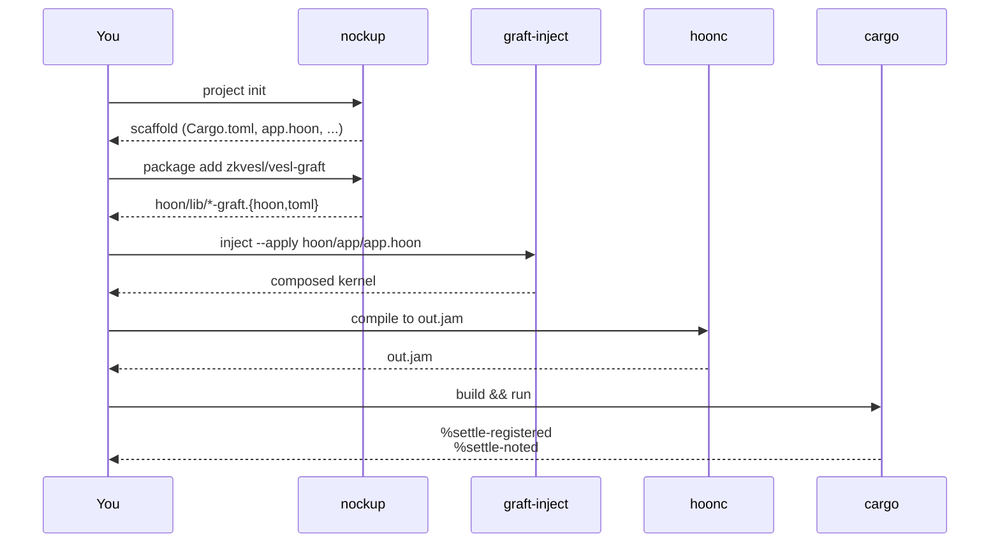

# Your first nockapp



Six steps end-to-end. Each section below stops at the smallest action that gets you to the next; deeper context lives on the linked page.

## 1. Scaffold a project

Write `nockapp.toml` describing the package and let `nockup` create the project:

```bash
cat > nockapp.toml <<'TOML'
[package]
name = "my-app"
version = "0.1.0"
description = "grafted NockApp"
template = "basic"
TOML

nockup project init
cd my-app
```

Three Cargo fixups are required before vesl deps will compile (path deps and two `[patch]` blocks including `[patch.crates-io] ibig`). See [Initialize a project](/setup/initialize) for the full block.

## 2. Install grafts

```bash
nockup package add zkvesl/vesl-graft -v latest
```

This drops the four commitment grafts plus shared libs (`vesl-merkle.hoon`, `zeke.hoon`, `ztd/*.hoon`) into `hoon/lib/` and `hoon/common/`. Then copy the marker template over the scaffolded `app.hoon`:

```bash
cp <vesl-nockup>/templates/app.hoon hoon/app/app.hoon
```

The nockup `basic` template's `app.hoon` doesn't contain the nine `::  nockup:*` markers `graft-inject` wires against. See [Install grafts](/build/install-grafts) for the registry-fallback path and the family taxonomy.

## 3. Wire the kernel

```bash
graft-inject inject hoon/app/app.hoon            # preview
graft-inject inject --apply hoon/app/app.hoon    # write
```

Preview is the default; nothing lands on disk until `--apply`. See [Wire with graft-inject](/build/wire) for the marker semantics, lint families, and per-graft sha256 banner.

## 4. Compile the kernel

```bash
hoonc hoon/app/app.hoon hoon/ && [ -s out.jam ] || \
  (echo "hoonc: silent-failed — exit 0 but no out.jam" >&2; exit 1)
```

The `[ -s out.jam ]` guard is load-bearing: hoonc can exit 0 with no jam written under structural type errors. See [Build & run](/build/build-run) for `vesl-test verify-jam`, the structured alternative.

## 5. Build the driver

```bash
cargo +nightly build
```

First build compiles the full nockchain stack — expect 2–5 minutes with path deps.

## 6. Exercise the lifecycle

Replace `src/main.rs` with a driver that registers a Merkle root and settles a note against it. Poke construction lives in `vesl-core`; you write the orchestration:

```rust
use std::error::Error;
use std::fs;

use nockapp::NockApp;
use nockapp::kernel::boot;
use nockapp::noun::slab::NounSlab;
use nockapp::wire::{SystemWire, Wire};
use vesl_core::{
    Mint, Tip5Hash,
    build_settle_register_poke, build_settle_note_poke,
};

#[tokio::main]
async fn main() -> Result<(), Box<dyn Error>> {
    let cli = boot::default_boot_cli(false);
    boot::init_default_tracing(&cli);
    let kernel = fs::read("out.jam")?;
    let mut app: NockApp = boot::setup(&kernel, cli, &[], "my-app", None).await?;

    let items: [&[u8]; 1] = [b"first"];
    let mut mint = Mint::new();
    let root: Tip5Hash = mint.commit(&items);

    poke(&mut app, build_settle_register_poke(1, &root)).await?;
    poke(&mut app, build_settle_note_poke(1, 1, &root, items[0])).await?;

    Ok(())
}

async fn poke(app: &mut NockApp, slab: NounSlab) -> Result<(), Box<dyn Error>> {
    let effects = app.poke(SystemWire.to_wire(), slab).await?;
    for tag in vesl_core::effect_head_tags(&effects) {
        println!("  effect: %{tag}");
    }
    Ok(())
}
```

Then:

```bash
cargo +nightly run
```

## Expected output

```
  effect: %settle-registered
  effect: %settle-noted
```

You now have a grafted NockApp with on-kernel Merkle verification and replay-protected settlement.

## What just happened

- **Mint** built a Merkle commitment over the input data and produced a root hash.
- The kernel registered that root under `hull = 1` and settled a note that proves a leaf belongs to the committed set.
- Each poke produced a tagged effect; `vesl_core::effect_head_tags` extracted them.

Read on:

- [Shape of a nockapp](/build/shape) — what the hull, grafts, and your domain are doing under the hood.
- [vesl-nockup README — Step 6 driver](https://github.com/zkvesl/vesl-nockup/blob/6e2127c/README.md#L246-L300) — pinned line range for the canonical 30-line driver.
- [`mint_lifecycle.rs`](https://github.com/zkvesl/vesl-nockup/blob/6e2127c/tools/graft-inject/tests/mint_lifecycle.rs) — Rust-native end-to-end test that mirrors the lifecycle above.
