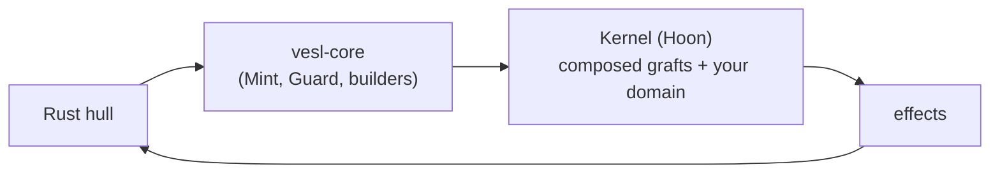

# What Is VESL

**[vesl](/reference/glossary#vesl) — Verifiable Execution and Settlement Layer — is the fastest path from a domain idea to a deterministic, cryptographically-settled app running on Nockchain.** You write a small [Hoon](/reference/glossary#hoon) [kernel](/reference/glossary#kernel) and a Rust [hull](/reference/glossary#hull); vesl supplies the commitment, state, and verification primitives in between, a CLI that composes them into your kernel, and an HTTP server that drops in front. The kernel does the math, the hull does the I/O, and vesl makes the seam between them survivable.

::: tip Linked terms
Bolded terms across this page link to their full entries on the [Glossary](/reference/glossary). Hover or click anywhere a term is bolded.
:::

## What vesl-nockup Ships

[**nockup**](/reference/glossary#nockup) is the recommended environment for building NockApps. [**vesl-nockup**](/reference/glossary#vesl-nockup) was designed to work hand in hand with nockup.

### Rust SDK — `vesl-core`

The [**`vesl-core`**](/reference/glossary#vesl-core) crate is the import target for every Rust hull in this ecosystem. It exports:

- **`Mint`** — build cryptographic commitments (Merkle trees) over your data and produce roots and proofs.
- **`Guard`** — verify those proofs locally, before sending anything to the kernel.
- **Poke builders** — one helper per operation a [**graft**](/reference/glossary#graft) supports, so you don't construct Hoon [**causes**](/reference/glossary#cause) by hand from Rust. Examples: `build_settle_register_poke`, `build_kv_set_poke`, `build_forge_prove_poke`.
- **Effect decoders** — `effect_head_tag` / `effect_head_tags` for routing on the [**effect**](/reference/glossary#effect) head; typed decoders (`decode_settle_error`, `decode_queue_popped`) for cell-payload effects.

[Build / vesl-core](/build/vesl-core) walks the full surface.

### Hoon Graft Library

Thirteen grafts ship today, organized into three [**families**](/reference/glossary#family). Each is a Hoon library plus a sibling [**manifest**](/reference/glossary#manifest); drop them into your kernel and they compose at injection time.

**Commitment family** — work with Merkle commitments and proofs.
- `mint-graft` — publish a Merkle root that future proofs verify against.
- `guard-graft` — publish a root and check whether items belong to it.
- [**`settle-graft`**](/reference/glossary#settle) — publish a root, verify items against it, and record each settlement once (no double-counting).
- `forge-graft` — generate zero-knowledge (STARK) proofs over committed data.

**State family** — durable application state primitives.
- `kv-graft` — string-keyed key-value store.
- `counter-graft` — named integer counters.
- `queue-graft` — FIFO job queue with stable IDs.
- `rbac-graft` — public-key role and permission table.
- `registry-graft` — strict structured registry with create / update / delete.

**Behavior family** — observe or constrain how the kernel processes incoming messages.
- `validate-graft` — pre-flight checks before a message reaches [**domain**](/reference/glossary#domain) logic.
- `log-graft` — append-only audit trail.
- `clock-graft` — deterministic event clock.
- `batch-graft` — buffer settlements and flush in batches.

Reserved: `intent-graft`, for future multi-party coordination. Not yet active. The [**trellis**](/reference/glossary#trellis) pattern (one kernel, multiple `hull=@` namespaces) layers cleanly across all three families.

### CLI — `nockup graft`

The [**`nockup graft`**](/reference/glossary#nockup-graft) command takes the grafts you want and weaves their code into your kernel automatically — you don't write graft glue code by hand. It discovers manifests under `hoon/lib/`, splices each declared [**block**](/reference/glossary#block) at the matching `::  nockup:*` [**marker**](/reference/glossary#marker) anchor in `app.hoon`, runs lint families, and emits per-graft sha256 banners so drift is detectable. Preview by default; `--apply` writes to disk. See [Inject](/build/grafts/inject) and the [CLI reference](/reference/cli).

### HTTP Server — `vesl-hull`

A vesl-nockup-native crate that mounts six axum endpoints (`/commit`, `/settle`, `/verify`, `/tx/{tx_id}`, `/status`, `/health`) on a booted kernel. The `vesl` template's `src/main.rs` is a clap dispatch between a `Demo` arm (one-shot lifecycle) and a `Serve` arm that boots the kernel and serves this surface. The Serve arm's full flag / auth / endpoint catalog lives on [Build & Run / Serve Subcommand](/build/build-run/serve).

### Scaffolds and Templates

Templates live under `templates/` and are scaffolded into a fresh project directory by `nockup project init`:

- **`templates/vesl/`** — the canonical starter. Ships markered Hoon, a clap `Demo`/`Serve` dispatch, and `vesl-test` in `[dev-dependencies]`.
- **`templates/graft-{mint,settle,scaffold,hash-gate,intent}/`** — focused single-primitive demos for learning a specific graft.
- **`templates/{counter,data-registry,settle-report}/`** — full example apps illustrating end-to-end domain integrations.

### Test Harness — `vesl-test`

A Rust harness for booting kernels in `#[tokio::test]`s and asserting on effects and [**peeks**](/reference/glossary#peek). Ships with a `vesl-test` CLI for one-shot peek inspection and a `verify-jam` subcommand that catches the silent-fail "out.jam exists but is stale" case — the highest-friction class of failure when iterating on Hoon. See [Build / Testing](/build/testing/).

### State and Settlement Plumbing

Three smaller crates round out the bundle:

- **`vesl-checkpoint`** — periodic [**snapshot**](/reference/glossary#snapshot) persistence so a kernel resumes without replaying every [**poke**](/reference/glossary#poke) since boot.
- **`vesl-signing`** — Schnorr-over-Cheetah signing helpers for catalog [**verification gates**](/reference/glossary#verification-gate) (`sig-verify-schnorr`, etc.).
- **`vesl-wallet`** / **`vesl-wallet-spec`** — BIP-39/BIP-44 wallet for dumbnet key derivation. See [Build & Run / Dumbnet Walkthrough](/build/build-run/dumbnet).

### Runtime Config — `vesl.toml`

[**`vesl.toml`**](/reference/glossary#vesl-toml) is the project-local runtime config: settlement modes, key derivation, chain endpoint, fee floors. See [vesl.toml reference](/reference/vesl-toml).

## Where vesl Ends and nockchain Begins

Nock is [**nockchain**](/reference/glossary#nockchain)'s combinator calculus. [**JAM**](/reference/glossary#jam) serialization, [**tip5**](/reference/glossary#tip5) hashing, the STARK proving stack, and the deterministic Nock interpreter are all nockchain's primitives — not vesl's. vesl runs a Hoon kernel inside nockchain's `NockApp` and ships a graft library on top: it does not invent determinism, proving, or the [**noun**](/reference/glossary#noun) model. See the [vesl-core README](https://github.com/zkvesl/vesl-core/blob/main/README.md) for a longer walk through the boundary.

## What's Next

- [Get started](/setup/quickstart) — three commands from empty directory to `%settle-registered` + `%settle-noted`.
- [NockApp Anatomy](/build/anatomy) — the conceptual layout (hull, grafts, domain) every other page assumes.
- [Glossary](/reference/glossary) — the term sheet linked from every bolded word on this page.
