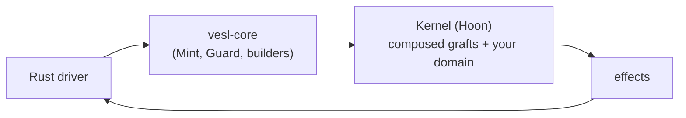

# What is vesl

vesl is a Rust SDK and Hoon graft library for building verifiable apps on Nockchain. You write a [Rust driver](/build/rust-driver) and a small [Hoon kernel](/build/kernel-hoon); vesl supplies the commitment, state, and verification primitives in between, plus a [CLI](/reference/cli) that composes them into your kernel.

## Concepts

Definitions for terms used through the rest of the guide. The [glossary](/reference/glossary) lists them alphabetically for quick reference.

**Hoon** — Nockchain's source language. Kernel files are Hoon.

**Kernel** — your compiled Hoon (`out.jam`). Pure logic, no I/O — receives pokes, returns effects plus new state, serves peeks.

**Driver / hull** — the Rust process that hosts the kernel (your `src/main.rs`). Mediates I/O between the outside world and the kernel; sometimes called *hull*. See [The Rust driver](/build/rust-driver).

**Graft** — a Hoon library plus a sibling TOML manifest that drops cleanly into your kernel. Thirteen ship today; `graft-inject` composes them. See [Grafts](/build/grafts).

**`graft-inject`** — the CLI that discovers grafts under `hoon/lib/`, splices their declared blocks into your kernel at marker comments, and writes the result. Preview by default. See the [CLI reference](/reference/cli).

**Manifest** — a graft's `<name>-graft.toml`. Declares which Hoon blocks land at which markers, which gates the graft uses, and metadata. See [Graft manifest schema](/reference/graft-manifest).

**`vesl-core`** — vesl's Rust SDK crate: `Mint`, `Guard`, builder helpers, and poke constructors for every shipped graft. See [vesl-core orientation](/going-deeper/vesl-core).

**`vesl-nockup`** — the recommended development environment for building nockapps; the subject of this guide. Ships the templates, `graft-inject`, and the example apps.

**`nockup`** — Nockchain's developer CLI. `vesl-nockup` will eventually ship as a package within it.

**nockchain** — the upstream runtime. Provides Nock, Hoon, the `NockApp` harness, JAM, and tip5. vesl runs on top.

**`vesl.toml`** — runtime config: settlement modes, key derivation, chain settings. See [vesl.toml reference](/reference/vesl-toml).

**JAM** — Nockchain's noun serialization format. `out.jam` is the jammed compiled kernel your driver loads.

## What you get

### A Rust SDK (`vesl-core`)

A Rust crate you import into your driver code (`src/main.rs`). It gives you:

- **`Mint`** — build cryptographic commitments (Merkle trees) over your data and produce roots and proofs.
- **`Guard`** — verify those proofs locally, before sending anything to the kernel.
- **Message builders** — one helper per operation a graft supports, so you don't construct Hoon messages by hand from Rust.

The full API lives in rustdoc; see [vesl-core](/going-deeper/vesl-core) for an orientation.

### A Hoon graft library

Hoon libraries you mix into your kernel — thirteen shipped, one reserved. Each packages a distinct capability so you compose your kernel from parts rather than implement them yourself.

**Commitment** — work with Merkle commitments and proofs.
- `mint-graft` — publish a Merkle root that future proofs verify against.
- `guard-graft` — publish a root and check whether items belong to it.
- `settle-graft` — publish a root, verify items against it, and record each settlement once (no double-counting).
- `forge-graft` — generate zero-knowledge (STARK) proofs over committed data.

**State** — durable application state primitives.
- `kv-graft` — string-keyed key-value store.
- `counter-graft` — named integer counters.
- `queue-graft` — FIFO job queue with stable IDs.
- `rbac-graft` — public-key role and permission table.
- `registry-graft` — strict structured registry with create / update / delete.

**Behavior** — observe or constrain how the kernel processes incoming messages.
- `validate-graft` — pre-flight checks before a message reaches domain logic.
- `log-graft` — append-only audit trail.
- `clock-graft` — deterministic event clock.
- `batch-graft` — buffer settlements and flush in batches.

**Reserved** — `intent-graft`, for future multi-party coordination. Not yet active.

### A CLI (`graft-inject`)

A command-line tool that takes the grafts you want and weaves their code into your kernel automatically — you don't write graft code by hand. Preview by default; `--apply` writes the result to disk. See [Wire with graft-inject](/build/wire) and the [CLI reference](/reference/cli).

## Where vesl ends and nockchain begins

Nock is [nockchain](https://github.com/nockchain/nockchain)'s combinator calculus. JAM serialization, the STARK proving stack, and the deterministic Nock interpreter are all nockchain's primitives — not vesl's. vesl runs a Hoon kernel inside nockchain's `NockApp` and ships a graft library on top: it does not invent determinism, proving, or the noun model. See the [vesl-core README](https://github.com/zkvesl/vesl-core/blob/main/README.md) for a longer walk through the boundary.

## What's next

- [Get started](/setup/quickstart) — three commands from empty directory to `%settle-registered` + `%settle-noted`.
- [Shape of a nockapp](/build/shape) — the conceptual layout (hull, grafts, domain) every other page assumes.
