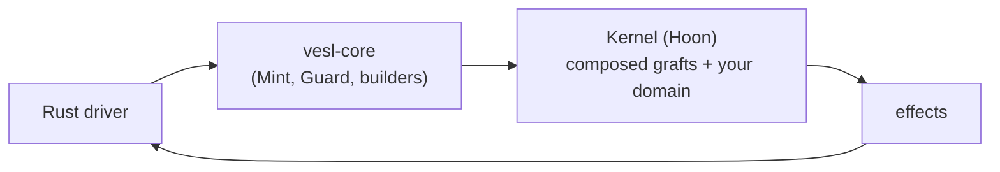

# What is vesl

vesl is a Rust SDK and Hoon graft library for building verifiable apps on Nockchain. You write a [Rust driver](/build/rust-driver) and a small [Hoon kernel](/build/kernel-hoon); vesl supplies the commitment, state, and verification primitives in between, plus a [CLI](/reference/cli) that composes them into your kernel.

## What you get

### A Rust SDK (`vesl-core`)

`Mint` and `Guard` for Merkle commitment math, plus `build_*_poke` helpers for every shipped graft cause tag. See [vesl-core](/going-deeper/vesl-core) for an orientation; the canonical API lives in rustdoc.

### A Hoon graft library

Thirteen shipped grafts across four families, plus a family-5 placeholder:

| Where | Name | Family | What it does |
|---|---|---|---|
| **Rust** | `Mint` | — (SDK) | Build Merkle trees, get roots, generate proofs. No kernel. |
| **Rust** | `Guard` | — (SDK) | Verify proofs against trusted roots locally. No kernel. |
| **Hoon** | `settle-graft` | 1 (commitment) | Register roots, verify payloads against a gate, settle notes with replay protection. |
| **Hoon** | `mint-graft` | 1 (commitment) | Append-only commitment of a Merkle root per `hull=@`. |
| **Hoon** | `guard-graft` | 1 (commitment) | Register a root per hull, check leaves against it (soft verify). |
| **Hoon** | `forge-graft` | 1 (commitment) | STARK-prove a Nock computation over committed data. Stateless. |
| **Hoon** | `kv-graft` | 3 (state) | Loose key-value store: `@t` keys, opaque atom values; overwrite-on-set, idempotent delete. |
| **Hoon** | `counter-graft` | 3 (state) | Named `@ud` counters; init-on-touch, saturate at `2^64-1`. |
| **Hoon** | `queue-graft` | 3 (state) | FIFO job queue with monotonic IDs; opaque body, polling-friendly empty-pop. |
| **Hoon** | `rbac-graft` | 3 (state) | Pubkey-keyed permission table; two-level capacity guard; auto-clear empty pubkeys. |
| **Hoon** | `registry-graft` | 3 (state) | Strict structured registry: create-only put, modify-only update, error-on-missing delete. |
| **Hoon** | `validate-graft` | 4 (behavior) | Pre-flight rule check on poke causes; rules install per cause-tag at runtime. |
| **Hoon** | `log-graft` | 4 (behavior) | Append-only audit trail with monotonic seq + caller-tag; retention cap 100k entries. |
| **Hoon** | `clock-graft` | 4 (behavior) | Deterministic event-counter clock; `[%clock-now ~]` returns the current `@da`. |
| **Hoon** | `batch-graft` | 4 (behavior) | Settlement-flush buffer; emits one `%batch-flushed` per N intents. |
| **Hoon** | `intent-graft` | 5 (placeholder) | Reserved for multi-party coordination. Crashes on invocation until upstream lands. |

The four commitment grafts share a unified `hull=@` key, so mint, guard, and settle can address the same logical cell. State grafts are domain-keyed and layer alongside commitment grafts without namespace collision. Behavior grafts wrap or observe poke flow via the `poke-prelude` and `poke-postlude` markers.

### A CLI (`graft-inject`)

Discovers manifests under `hoon/lib/`, splices each graft's blocks into your kernel at the marker comments, and writes the result. Preview by default; `--apply` writes to disk. See [Wire with graft-inject](/build/wire) and the [CLI reference](/reference/cli).

## Where vesl ends and nockchain begins

Nock is [nockchain](https://github.com/nockchain/nockchain)'s combinator calculus. JAM serialization, the STARK proving stack, and the deterministic Nock interpreter are all nockchain's primitives — not vesl's. vesl runs a Hoon kernel inside nockchain's `NockApp` and ships a graft library on top: it does not invent determinism, proving, or the noun model. See the [vesl-core README](https://github.com/zkvesl/vesl-core/blob/main/README.md) for a longer walk through the boundary.

## What's next

- [Install](/setup/install) — toolchain prerequisites and the `[patch.crates-io] ibig` block every developer hits on first build.
- [Your first nockapp](/setup/quickstart) — six steps end-to-end.
- [Shape of a nockapp](/build/shape) — the conceptual layout (hull, grafts, domain) every other page assumes.
